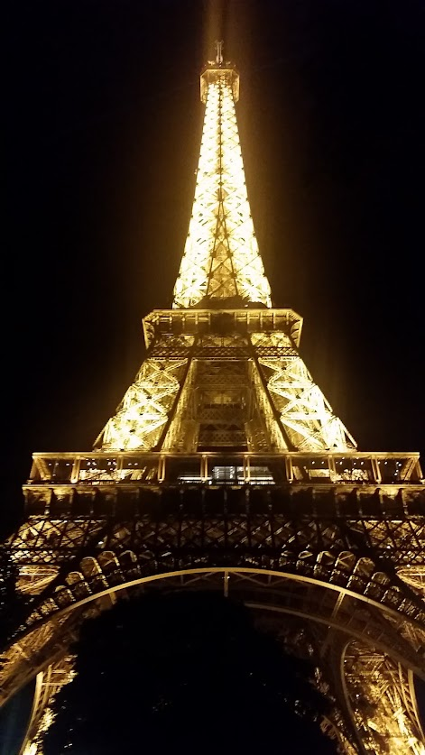

  
  # m
  ## Description
  m
  ## Table of Contents
  * [Installation](#installation)
  * [Usage](#usage)
  * [License](#license)
  * [Contributions](#contributions)
  * [Testing](#testing)
  * [Questions](#questions)
  
  ## Installation
  m
  
  ## Usage
  m
  ## License
  * This application is covered under the AAL license
  ## Contributions
  m
  
  ## Testing
  m
  
  ## Any Questions
  This project was created by me: [m](m)
  
  Contact me with any questions at: [m](m)

  
